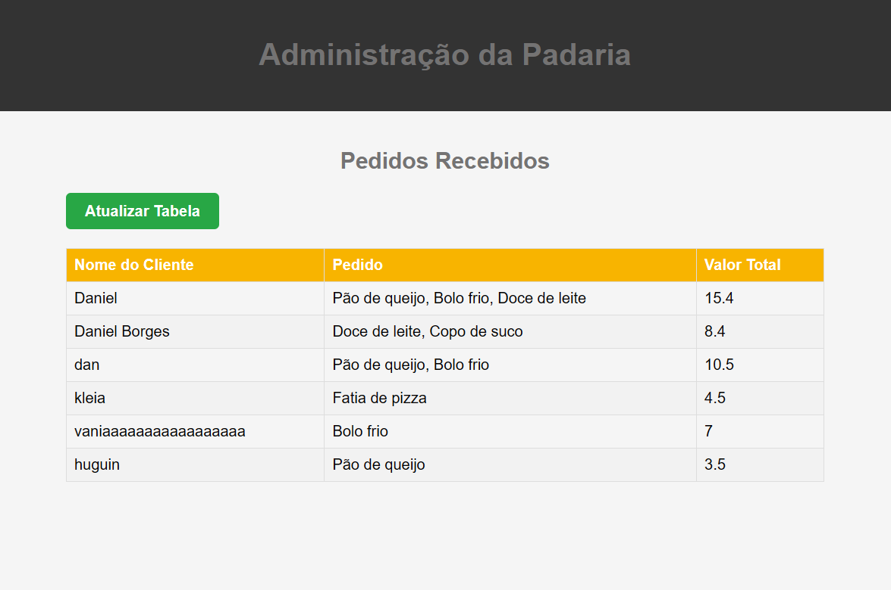
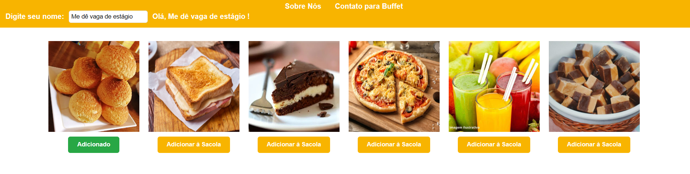

# Shopping Bag !!!

Esse projeto mostra a interação entre dois sites separados, um é a recepeção de um padaria no qual o usuário pode pedir seu lanche, o outro é o que os administradores e trabalhadores da padaria veriam, recebem o nome, ítens comprados e etc.

O foco é trabalhar no backend, na programação de um servidor simples usando Node.js com a biblioteca Express e trabalhar conceitos e funcionalidades do backend.

## Screenshots





## PArte do código do backend

```javascript
const express = require('express'); 
const cors = require('cors')

const app = express();              
const port = 3001;

const allowedOrigins = ['http://127.0.0.1:5510', 'https://danielbgoncalves.github.io'];

const corsOption = {
```


## 🚀 Sobre mim
Estudante de Ciência da Computação em Uberlândia, aspirante a backend 

